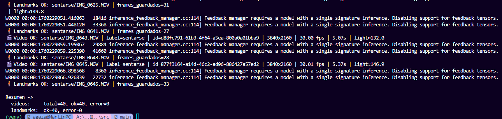
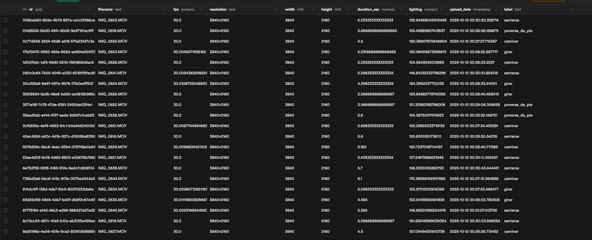
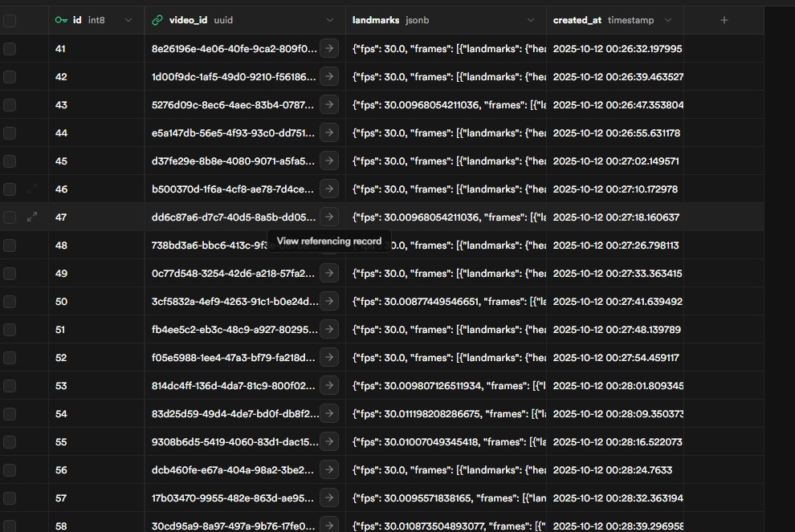

# Recolección de datos para reconocimiento de actividades en video

Los scripts de este directorio permiten cargar información de videos almacenados localmente a una base de datos en Supabase. La información incluye metadatos del video y, opcionalmente, puntos de referencia (landmarks) extraídos usando MediaPipe.

## Pasos para usar los scripts

1. **Configurar el entorno**:
   - Crear un entorno virtual e instalar las dependencias:
     ```bash
     python -m venv venv
     source venv/bin/activate  # En Windows: venv\Scripts\activate
     pip install -r requirements.txt
     ```
    - Crear un archivo `.env` basado en el ejemplo proporcionado, configurando las variables necesarias:
        ```env
        SUPABASE_URL=https://<tu-proyecto>.supabase.co
        SUPABASE_ANON_KEY=<tu-anon-key>
        VIDEOS_DIR=../../videos   # opcional, por defecto ../../videos
        MAX_SAMPLES=60            # opcional (número máx de frames a muestrear)
        SAMPLE_STRIDE_SEC=0       # opcional; si >0 fuerza salto fijo en segundos
        INSERT_LANDMARKS=1        # 1 para extraer landmarks, 0 para no extraer
        ```
    - Asegurarse de que la base de datos en Supabase tenga las tablas necesarias. Un script SQL de ejemplo se encuentra en `sources/scriptDDL.sql`.
2. **Preparar los videos**:
    - Colocar los videos en el directorio especificado por `VIDEOS_DIR`, asegurandose que la ruta sea el nombre que quieran/la actividad que estén reconociendo, por ejemplo 


Aqui la puse a nivel de proyecto, pero puede ser en cualquier lugar, solo hay que cambiar la ruta en el .env. Por ejemplo en este caso en el .env pondria `VIDEOS_DIR=../../videos` (por que el script esta en Entrega1/src y los videos en videos a nivel de proyecto)

    - Asegurarse de que los nombres de los archivos de video sean únicos.
    - Los videos deben estar en formatos compatibles con OpenCV (como .mp4, .avi, .mov, etc.).

3. **Ejecutar el script**

    - Navegar al directorio `Entrega1/src` y ejecutar el script:
      ```bash
      python load_video_info_to_supabase.py
      ```
    - El script procesará cada video en el directorio especificado, extrayendo metadatos y, si está habilitado, puntos de referencia usando MediaPipe. Luego, insertará esta información en la base de datos en Supabase.





