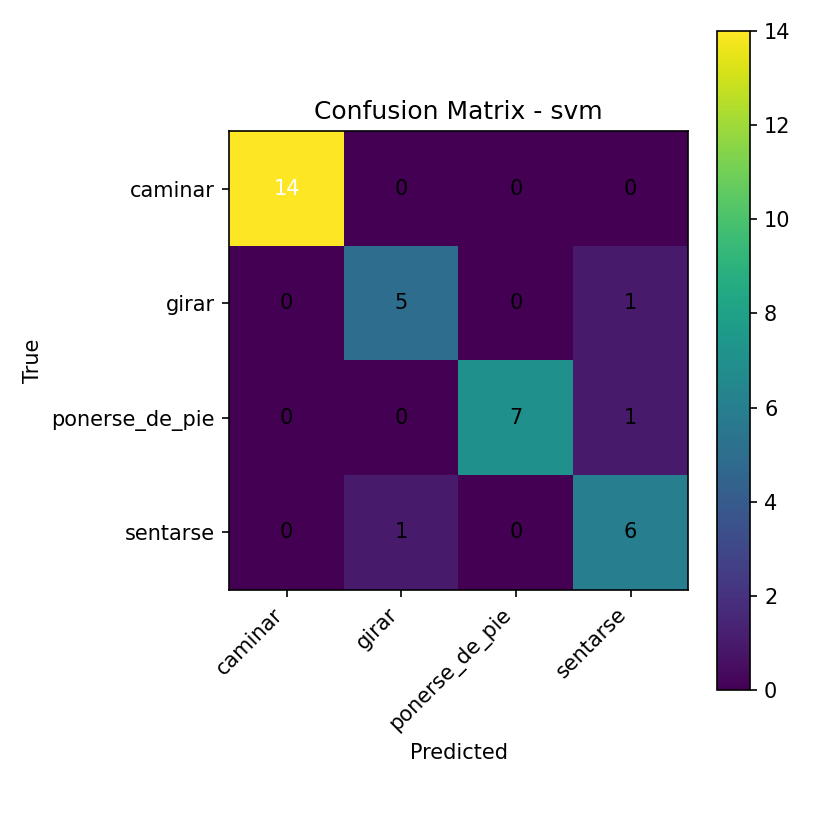
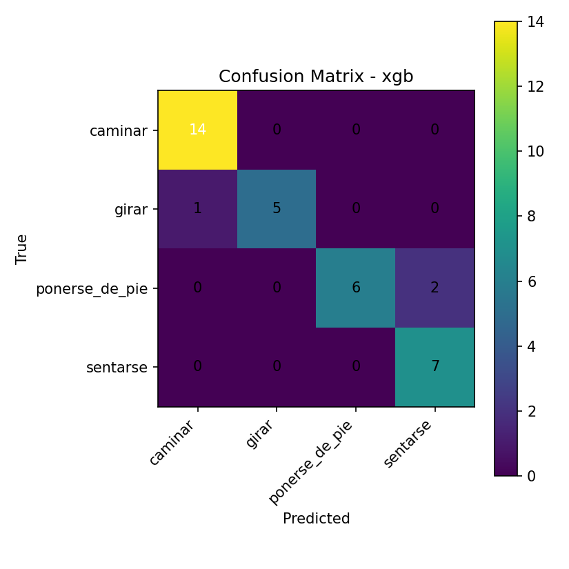

# Informe – Entrega 2  
## 1. Flujo de trabajo y metodología

El sistema implementado aborda el reconocimiento de actividades humanas (HAR) a partir de videos, 
pero **sin procesar los videos directamente en píxeles**.  
En lugar de ello, se extraen **landmarks corporales** usando *MediaPipe Pose*, 
obteniendo las coordenadas tridimensionales de las articulaciones por frame 
(`x, y, z, visibility`).  
Esto permite representar el movimiento de una persona como una secuencia de posiciones 
numéricas en el espacio, eliminando dependencias de fondo, color o iluminación.

### 1.1. Razonamiento metodológico
No se entrenaron redes convolucionales sobre imágenes o frames, 
porque ese enfoque requiere grandes volúmenes de datos y GPU de alto rendimiento.  
El uso de landmarks ofrece una representación cinemática compacta y eficiente 
que conserva la información relevante para clasificar posturas y movimientos.  
Cada video se convierte así en una **serie temporal de articulaciones humanas**, 
base para el modelado con algoritmos clásicos de machine learning.

### 1.2. Flujo técnico general

El proyecto se organiza en módulos bajo `src/` y se ejecuta mediante tres notebooks:

| Notebook | Etapa | Descripción |
|-----------|--------|-------------|
| `01_preprocesamiento.ipynb` | Limpieza y normalización | Carga datos desde Supabase/CSV, filtra por visibilidad, normaliza y genera `features.csv`. |
| `02_modelado.ipynb` | Entrenamiento | Ejecuta los clasificadores definidos en `src/models/train_models.py` con GridSearchCV. |
| `03_resultados.ipynb` | Evaluación y análisis | Carga métricas, matrices y gráficas de importancia para comparar modelos. |

Los notebooks actúan como controladores de análisis, 
mientras que los archivos de `src/` contienen la lógica modular reutilizable.

---

## 2. Diseño de los modelos

Tres modelos fueron implementados para comparar desempeño:

1. **SVM (Support Vector Machine)**  
   - Implementado con `sklearn.svm.SVC` en un pipeline con `StandardScaler`.  
   - Ajuste de hiperparámetros mediante `GridSearchCV` con validación cruzada (k=3).  
   - Parámetros explorados: `C`, `kernel` (`linear`, `rbf`), `gamma`.  

2. **Random Forest**  
   - Modelo de ensamblado de árboles (`sklearn.ensemble.RandomForestClassifier`).  
   - Ajuste con rejilla de hiperparámetros (`n_estimators`, `max_depth`, `min_samples_split`, `min_samples_leaf`).  
   - Permite extraer **importancia de características**, útil para interpretación.

3. **XGBoost**  
   - Clasificador de gradiente optimizado (`xgboost.XGBClassifier`).  
   - Parámetros: `max_depth`, `learning_rate`, `subsample`, `colsample_bytree`.  
   - Entrenado con validación cruzada idéntica (cv=3, f1-weighted).  

El proceso de entrenamiento se centraliza en `src/models/train_models.py`, 
donde se definen los **grids**, la división de datos (80 % train / 20 % test), 
y se exportan los artefactos entrenados (`.joblib`) junto con los reportes JSON 
y las matrices de confusión.

---

## 3. Resultados obtenidos

### Tablas de métricas por modelo

## SVM

| label | precision | recall | f1-score | support |
| :--- | :--- | :--- | :--- | :--- |
|  caminar | 0.933 | 1.000 | 0.966 | 14.0 |
|  girar | 1.000 | 0.833 | 0.909 | 6.0 |
|  ponerse\_de\_pie | 1.000 | 0.875 | 0.933 | 8.0 |
|  sentarse | 0.875 | 1.000 | 0.933 | 7.0 |
|  macro avg | 0.952 | 0.927 | 0.935 | 35.0 |
|  weighted avg | 0.948 | 0.943 | 0.942 | 35.0 |

---

## RF

| label | precision | recall | f1-score | support |
| :--- | :--- | :--- | :--- | :--- |
|  caminar | 0.933 | 1.000 | 0.966 | 14.0 |
|  girar | 1.000 | 0.833 | 0.909 | 6.0 |
|  ponerse\_de\_pie | 1.000 | 0.750 | 0.857 | 8.0 |
|  sentarse | 0.778 | 1.000 | 0.875 | 7.0 |
|  macro avg | 0.928 | 0.896 | 0.902 | 35.0 |
|  weighted avg | 0.929 | 0.914 | 0.913 | 35.0 |

---

## XGBoost

| label | precision | recall | f1-score | support |
| :--- | :--- | :--- | :--- | :--- |
|  caminar | 0.933 | 1.000 | 0.966 | 14.0 |
|  girar | 1.000 | 0.833 | 0.909 | 6.0 |
|  ponerse\_de\_pie | 1.000 | 0.750 | 0.857 | 8.0 |
|  sentarse | 0.778 | 1.000 | 0.875 | 7.0 |
|  macro avg | 0.928 | 0.896 | 0.902 | 35.0 |
|  weighted avg | 0.929 | 0.914 | 0.913 | 35.0 |

### Visualización de matrices de confusión (Tambien adjuntos en notebook 03_resultados)

- **Comparación global**:
XGBoost y Random forest tuvieron las mismas metricas. Alcanzaron un F1-score promedio ponderado aproximadamente de 0.90 , mientras que el modelo SVM obtuvo un valor aún mayor, cercano a 0.93. En los tres casos, la precisión ponderada fue mayor que el recall, lo que indica que los modelos tienden a cometer más errores de omisión (falsos negativos) que de comisión (falsos positivos), es decir, son más conservadores al predecir las clases. **SVM es el modelo seleccionado para resolver el problema.**

- **Clase Caminar:**
En la clase "caminar", los tres modelos alcanzaron un recall perfecto (1.00) y una precisión muy alta (≥0.93), mostrando que esta actividad es la más fácil de identificar. 

- **Clase Girar:**
Para "girar", todos los modelos también lograron una precisión de 1.00 y un recall de 0.83, lo que indica que rara vez confunden otras clases con "girar", pero a veces no detectan todos los casos reales.

- **Clase Ponerse de pie:**
La mayor diferencia se observa en la clase "ponerse_de_pie": el modelo SVM obtuvo un recall de 0.875, mientras que Random Forest y XGBoost alcanzaron 0.75, es decir, SVM identificó correctamente más casos de esta actividad (más de 10 puntos porcentuales de diferencia). Sin embargo, la precisión en esta clase fue perfecta (1.00) en todos los modelos, lo que significa que cuando predicen "ponerse_de_pie", casi nunca se equivocan, pero los modelos de árboles tienden a dejar pasar más casos reales.

- **Clase Sentarse:**
En "sentarse", SVM tuvo una precisión de 0.875 y recall de 1. Los otros dos modelos lograron un recall perfecto (1.00) pero con precisión menor (0.78). Esto sugiere que Random Forest y XGBoost tienden a sobrepredecir la clase "sentarse", mientras que SVM es más conservador pero comete menos falsos negativos.

- **Matrices de confusión**:
Las matrices de confusión muestran que en XGBoost y Random forest los fallos ocurren entre las clases "ponerse_de_pie" y "sentarse", donde a veces se confunden entre sí. En general, la diagonal principal está bien definida, especialmente para la clase "caminar", que casi no presenta errores. Los modelos de árboles (Random Forest y XGBoost) tienden a tener más falsos negativos en "ponerse_de_pie", mientras que SVM distribuye mejor los aciertos en esa clase. En "girar", los errores son pocos y suelen deberse a confusiones con "caminar" (arboles) y girar para (SVM). Esto confirma que las actividades con posturas o transiciones similares son las más difíciles de distinguir para los modelos.

- **Importancia de características**:
Aunque ambos modelos de árboles permiten interpretar la importancia de las variables, los resultados no son completamente coincidentes. Random Forest destaca principalmente variables asociadas al movimiento y posición de la rodilla y cadera izquierda, mientras que XGBoost otorga mayor peso a la velocidad de la cabeza y la rotación del torso, además de algunas variables de la pierna. Si bien hay algunas coincidencias (como la relevancia de la rodilla izquierda), el orden y el peso relativo de las características varía bastante entre ambos modelos. Esto sugiere que cada algoritmo está capturando patrones distintos en los datos y que la interpretación de las variables más importantes depende del enfoque del modelo.

---

## 4. Análisis de impacto

| Dimensión   | Efectos Positivos | Efectos Negativos | Estrategias de Mitigación |
|--------------|------------------|-------------------|----------------------------|
| **Social** | Permite una evaluación objetiva del movimiento humano y fomenta la autonomía en procesos de salud y rehabilitación. | Puede generar percepciones de vigilancia o riesgos de privacidad si no se comunica adecuadamente el uso de los datos. |  Aplicar consentimiento informado, anonimización de datos y regular el acceso al aplicativo.  |
| **Económica** | Su bajo costo y requerimiento computacional facilitan la adopción en contextos con recursos limitados, y podría aprovecharse en el sector comercial para analizar patrones de comportamiento de clientes y optimizar servicios. | Empresas podrían usar el sistema para monitorear a sus clientes sin su consentimiento, obteniendo patrones de movimiento o interacción con fines comerciales no transparentes. | Establecer límites éticos y regulatorios claros sobre el uso de los datos, promoviendo la transparencia y el consentimiento informado en cualquier aplicación con fines económicos. |
| **Ambiental** |  Presenta bajo consumo energético al no depender de GPU ni grandes infraestructuras. | La implementación masiva puede incrementar el consumo total si no se optimiza el procesamiento. |  Optimizar la eficiencia energética y promover prácticas sostenibles en el desarrollo y uso del sistema. Tambien verificar opciones menos efectivas en pro de consumo menor.  |
| **Global** | Su diseño adaptable permite aplicarlo en distintos contextos, desde la salud hasta el ámbito educativo, favoreciendo la inclusión tecnológica. | Puede presentar sesgos en los modelos que afecten la precisión o la interpretación de resultados en diferentes culturas o poblaciones. | Realizar auditorías periódicas y ajustar los modelos para garantizar equidad, diversidad y cumplimiento regulatorio en cada contexto. |

---

## 5. Plan de despliegue

Para facilitar la adopción y portabilidad de la solución, se propone empaquetar el sistema completo en un contenedor Docker. Esto permitirá que cualquier usuario pueda instalar y ejecutar el programa sin preocuparse por dependencias o configuraciones específicas del entorno.

El producto final será una aplicación Python que:
- Captura los fotogramas de una cámara en tiempo real.
- Extrae los landmarks corporales usando MediaPipe.
- Ejecuta el modelo de clasificación entrenado (SVM) sobre los datos capturados.
- Muestra en pantalla la predicción de la actividad humana detectada, permitiendo la visualización en tiempo real.

El uso de Docker garantiza que el sistema sea fácilmente portable entre diferentes sistemas operativos (Windows, Linux, MacOS) y que la instalación sea sencilla, requiriendo solo tener Docker instalado. Además, esto facilita futuras actualizaciones y el despliegue en diferentes contextos, como laboratorios, clínicas o centros deportivos.
